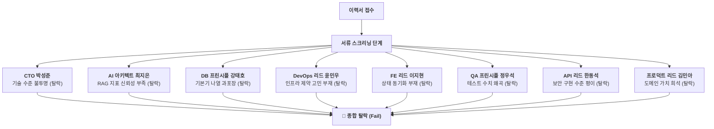

# ❄️ 20년차 테크리더 8인의 포트폴리오 냉정 진단 리포트

> **"이력서에 '당연한 기본기'를 성과인 양 늘어놓는 것은 역설적으로 '이것 외에는 깊이가 없다'는 고백입니다. 8인의 채용위원회가 심우현님의 이력서를 5초 동안 훑어보고 내린 판정 결과입니다."**

---

## 📊 종합 판정 결과

*   **현재 이력서 종합 판정**: 🔴 **서류 스크리닝 탈락 (Fail at Document Screening)**
*   **평가 위원회 종합 의견**: 
    전형적인 신입/부트캠프 출신의 보일러플레이트 코드 기반 포트폴리오. 아키텍처적 깊이나 현실적인 제약사항에 대한 고민이 없고, 단순히 기술 스택의 명칭만 화려하게 포장(Fluff)하여 나열함. 이 상태로는 메이저 IT 기업이나 기술력이 있는 스타트업의 1차 서류를 통과할 가능성이 매우 낮음.

---

## 🏛️ 테크리더 8인의 날것 그대로의 평가 (Brutal Reviews)

---

### 1. 👨‍💼 박성준 (CTO / 위원장)
*   **평가 의견**: **"비즈니스 가치가 전혀 안 보입니다."**
    *   "이력서 전반이 '주니어 개발자가 최신 유행 기술을 이것저것 갖다 써서 공부했다'는 학업성취도 평가서 같습니다. 개발자를 뽑는 것은 기술 공부를 대신 시켜주기 위함이 아니라 비즈니스 리스크를 해결하기 위함입니다. 
    *   특히 `HyperStar` 프로젝트의 **'CES 2026 시연 제품 QA 전담'**은 개발자인지 단순 수동 테커인지 모호합니다. 소스가 프라이빗이라고 하더라도 어떤 API를 설계했고, 어떤 예외 상황을 구조적으로 방어했는지 기술적으로 설명하지 못하면 '그냥 숟가락만 얹은 프로젝트'로 판정하고 버릴 것입니다."
*   **판정**: **불합격 (Fail)**

### 2. 👩‍💻 최지은 (AI Agent & RAG Lead Architect)
*   **평가 의견**: **"RAGAS 점수가 왜 이렇게 잘 나오죠? 가짜 지표 같습니다."**
    *   "RAGAS Faithfulness 지표가 0.28에서 0.80으로 개선되었다고 적혀 있는데, RAG 평가 데이터셋(Test Dataset)을 몇 개나 구축해서 검증했는지 정보가 전혀 없습니다. 만약 10개 남짓한 임의의 프롬프트 질의로 테스트해서 올린 점수라면, 실제 배포 시 아무 쓸모가 없는 '체리 피킹(유리한 데이터만 선택)' 지표입니다.
    *   실무에서 LangGraph 멀티 에이전트를 돌릴 때 가장 머리 아픈 것은 '비결정적인 무한 루프'와 'API 토큰 비용 폭탄'입니다. 이에 대한 구체적인 비용 방어 기법이 적혀있지 않아 실무 투입 시 무서워서 에이전트를 가동시키지 못할 것 같습니다."
*   **판정**: **불합격 (Fail)**

### 3. 👨‍💻 강태호 (Database & Data Platform Principal)
*   **평가 의견**: **"Controller-Service-Repository 분리가 성과라니요?"**
    *   "`TechLens` 프로젝트에서 CSR 아키텍처 도입을 주요 성과로 적어둔 것을 보고 쓴웃음이 났습니다. 이건 백엔드 개발자라면 자랑이 아니라 '기본 의무'입니다. 당연한 패키징 규칙을 성과 칸에 적었다는 것은 역설적으로 **내세울 만한 DB 성능 개선이나 데이터 정제 설계 능력이 없다**는 뜻입니다.
    *   공공데이터 수집 파이프라인 역시 하루 트래픽 and 데이터 규모가 명시되어 있지 않아, 그냥 KIPRIS API 한 번 찔러서 로컬 DB에 Insert 한 토이 프로젝트 수준으로 간주하겠습니다."
*   **판정**: **불합격 (Fail)**

### 4. 👨‍💻 윤민우 (DevOps & Infrastructure Lead)
*   **평가 의견**: **"Docker, Render 프리티어는 누구나 올립니다."**
    *   "Docker와 Render를 써서 배포했다는 것은 주니어 개발자들의 공통 보일러플레이트 템플릿입니다. 
    *   Render.com 프리티어의 가장 잔인한 조건은 512MB RAM 스펙입니다. 파이썬 백엔드에 Pinecone 클라이언트와 NLP 분석 라이브러리(Kiwi 등)를 얹어서 올리면, 실제 운영 시 백발백중 OOM(Killed) 크래시가 났을 텐데 이에 대한 **메모리 프로파일링 및 튜닝 흔적**이 전혀 보이지 않습니다. 진짜 OOM 문제를 겪어보고 해결했는지 깊이가 의심스럽습니다."
*   **판정**: **불합격 (Fail)**

### 5. 👩‍💻 이지현 (Frontend & UX Principal)
*   **평가 의견**: **"Next.js와 Zustand를 썼다는데, 상태 동기화 설계는 어디 있죠?"**
    *   "`Playce` 프로젝트에서 Kakao Maps를 그리면서 Zustand와 URL 쿼리 파라미터를 연동했다고 했습니다. 지도 중심 좌표, 필터 상태, URL 쿼리가 3방향으로 꼬이면서 무한 리렌더링이나 브라우저 뒤로가기 시 싱크가 깨지는 버그가 반드시 발생했을 텐데, 이에 대한 단방향 데이터 흐름(Single Source of Truth) 설계가 보이지 않습니다.
    *   Vite 환경에서 기본으로 탑재되는 'Code Splitting'을 성과로 포장한 것도 감점 요인입니다. 이 기술을 직접 튜닝한 게 아니라면 성과로 적지 마십시오."
*   **판정**: **불합격 (Fail)**

### 6. 👨‍💻 정우석 (QA & Quality Assurance Principal)
*   **평가 의견**: **"테스트 개수는 아무런 의미가 없습니다."**
    *   "이력서에 'Vitest 109개, Playwright 28개 테스트 작성'이라고 자랑하듯 개수를 채워 넣었습니다. 
    *   카카오맵 같은 외부 지도 API는 CDN을 통해 비동기로 스크립트가 로드되기 때문에, 명시적으로 로딩 완료 시점을 동기화하지 않고 Playwright를 돌리면 외부 서버 지연 상태에 따라 빌드가 통과했다가 실패했다가 하는 **Flaky Test의 온상**이 됩니다. CI 빌드를 깨뜨리는 이 Flakiness 문제를 해결하기 위해 어떤 명시적 폴링이나 이벤트 동기화를 도입했는지 적혀있지 않다면, 이 테스트 코드들은 신뢰성 제로입니다."
*   **판정**: **불합격 (Fail)**

### 7. 👨‍💻 한동석 (Security & API Platform Lead)
*   **평가 의견**: **"Access/Refresh 토큰 검증은 제대로 했나요?"**
    *   "`TechLens`에 JWT 기반 인증을 구현했다고 되어 있는데, 토큰들을 클라이언트의 어디에 저장했는지(LocalStorage? httpOnly Cookie?), Refresh Token의 CSRF 공격 방어를 위해 어떤 미들웨어를 두었는지 전혀 유추할 수 없습니다. 그냥 튜토리얼 블로그 글 보고 복사해서 토큰 발행만 한 수준으로 해석됩니다. 
    *   보안 관련하여 `slowapi` 라이브러리로 Rate Limiting을 걸었다는데, DDoS 방어 수준도 아니고 토이 프로젝트에 걸어둔 설정값 정도로 느껴져 깊이가 얕습니다."
*   **판정**: **불합격 (Fail)**

### 8. 👩‍💻 김민아 (Product Engineer Lead)
*   **평가 의견**: **"가장 비즈니스 가치가 높은 ClaimLens가 묻혀 있습니다."**
    *   "이 이력서에서 가장 독창적이고 특허 도메인에서 비즈니스 가치가 높은 기술은 `ClaimLens` 모듈(특허 청구항 구성요소 완비 법칙 자동 분석 알고리즘)입니다. 
    *   이 중요한 도메인 로직은 단 한 줄로 지나가듯 적어놓고, JWT 인증이나 CSR 아키텍처 같은 흔한 백엔드 보일러플레이트에 지면을 낭비하고 있습니다. 프로덕트 관점에서 강점이 완전히 가려져 있습니다."
*   **판정**: **불합격 (Fail)**

---

## 🛠️ 서류 통과(서합)를 위한 핵심 수술 가이드라인

8인의 피드백을 요약하면, **"당연히 해야 하는 개발 기본기는 1줄로 지우거나 숨기고, 실제 겪은 제약 조건과 엔지니어링 의사결정을 트러블슈팅 형태로 전면에 세워라"**입니다.

1.  **TechDocs**: 
    *   RAGAS 점수의 정량적 데이터셋(예: "KIPRIS 추출 50개 테스트 셋 기반") 기준 명시.
    *   Render 512MB RAM 극복을 위한 Kiwi C++ 로더 배제 및 정규식 토큰화 우회 서사 전면 배치.
    *   매 요청마다 Pinecone에서 fetch하는 병목을 SQLite FTS5 로컬 캐싱으로 우회한 판단 근거 수록.
2.  **Playce**:
    *   테스트 코드의 개수 자랑을 지우고, **비동기 지도 SDK 마운팅 지연으로 인한 Playwright Flaky Test 해결기**를 트러블슈팅 형태로 포지셔닝.
    *   Zustand와 URL 파라미터 간의 무한 리렌더링을 잡은 단방향 데이터 흐름 설계 강조.
3.  **TechLens**:
    *   Zod validation과 CSR 분리 등 보일러플레이트 기술은 '당연한 것'이므로 즉시 삭제.
    *   KIPRIS 외부 API의 쿼터 제한 및 느린 레이턴시 속에서 Postgres 배치 인제스천 파이프라인의 멱등성(`ON CONFLICT`)을 유지한 설계를 핵심 성과로 강조.
